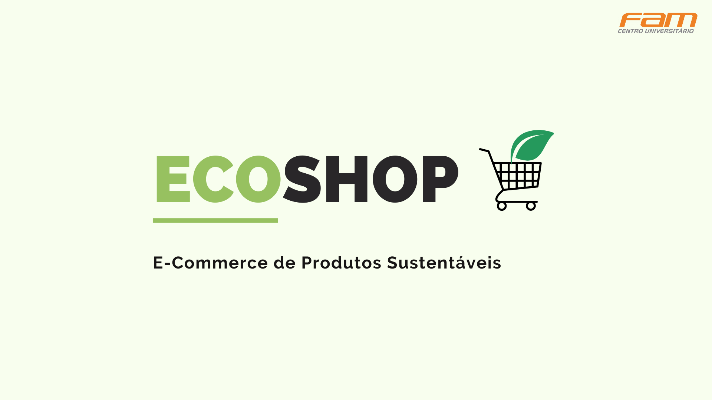

  
  

  

 

  <h3><b>EcoShop</b></h3>

  
Projeto Integrador desenvolvido no 5º Semestre da faculdade de Análise e Desenvolvimento de Sistemas na FAM - Centro Universitário das Américas.
  

  

#

  <h3><b>Resumo</b></h3>

  O artigo apresenta o desenvolvimento de uma aplicação e-commerce (comércio eletrônico) multiplataforma, na qual a problemática apresentada são os problemas ambientais urbanos causados pelo uso excessivo e má reciclagem de produtos prejudiciais ao meio ambiente. O usuário poderá comprar e vender produtos sustentáveis, com o objetivo de comercializar itens, objetos, peças e até mesmo serviços dentro das comunidades que necessitam de assentamento humano e ações sustentáveis, para apoiar em relações econômicas, sociais e ambientais positivas entre áreas urbanas.

 

  <h4>
    <b>
      <a href="https://github.com/Biellms/ProjetoIntegrador-EcoShop/tree/main/BackEnd/ecoshop" target="_blank">
• Back-end ♨️
      </a>
    </b>
  </h4>

  <h4>
    <b>
      <a href="https://github.com/Biellms/ProjetoIntegrador-EcoShop/tree/main/FrontEnd/ecoshop" target="_blank">
• Front-end ⚛️
      </a>
    </b>
  </h4>

  <h4>
    <b>
      <a href="https://github.com/Biellms/ProjetoIntegrador-EcoShop/blob/main/Documentacao/EcoShop%20Artigo.pdf" target="_blank">
• Artigo 📝
      </a>
    </b>
  </h4>

